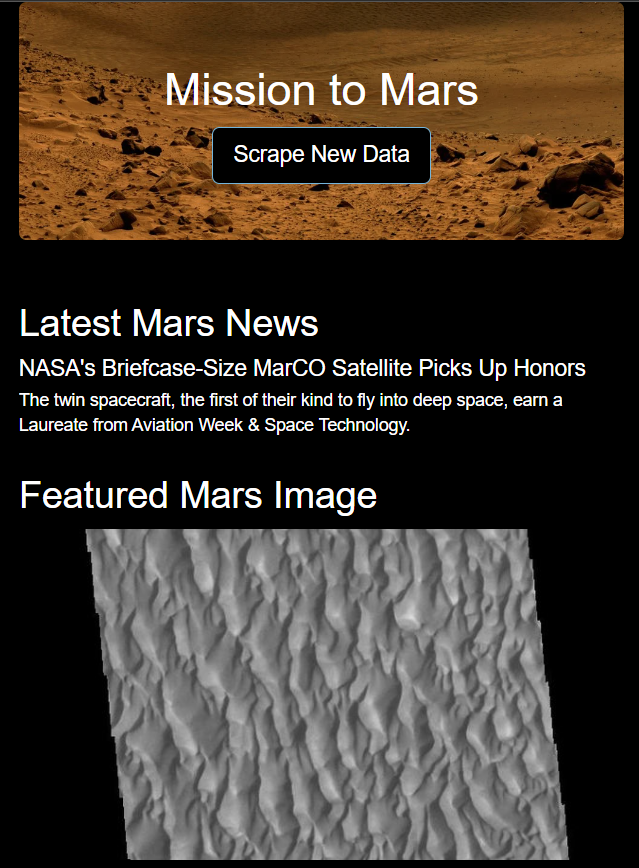
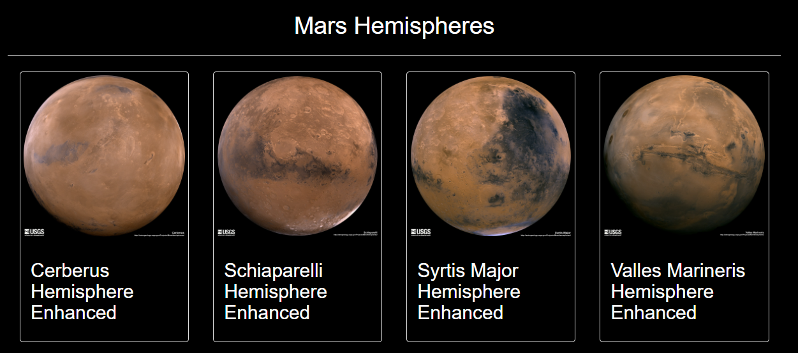

# Mission to Mars: Webscraping 

## Overview
This web application automatically scrapes four websites for Mars data, stores it in MongoDB, and uses Flask to display the latest information on a HTML page.

## Resources
- **Data Sources:** [Mars News](https://data-class-mars.s3.amazonaws.com/Mars/index.html), [Mars Image](https://data-class-jpl-space.s3.amazonaws.com/JPL_Space/index.html), [Mars Facts](https://data-class-mars-facts.s3.amazonaws.com/Mars_Facts/index.html), [Mars Hemispheres](https://marshemispheres.com/)
- **Software:** Python 3.7.13, MongoDB 6.0, Splinter 0.18.0, BeautifulSoup4 4.11.1, WebDriver Manager 3.8.3, BootStrap 3.3.7, Flask, Jupyter Notebook

## Screenshots

